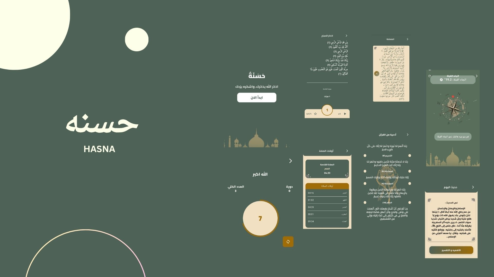

🇸🇦 حسنة | Hasna
تطبيق حسنة هو تطبيق إسلامي شامل يهدف إلى مساعدة المستخدمين في الحفاظ على صلتهم اليومية بالله.
يوفّر التطبيق:

أذكار الصباح والمساء

مجموعة من الأدعية من السنة النبوية

مواقيت الصلاة حسب الموقع الجغرافي

اتجاه القبلة بدقة

تذكيرات يومية للذكر، لتسهيل كسب الحسنات في كل وقت

🇬🇧 English Description
Hasna App is a comprehensive Islamic app designed to help users stay spiritually connected every day.
It provides:

Morning and evening adhkar

A collection of prophetic supplications

Accurate prayer times based on location

Precise Qibla direction

Daily reminders for dhikr, making it easier to gain rewards throughout the day

